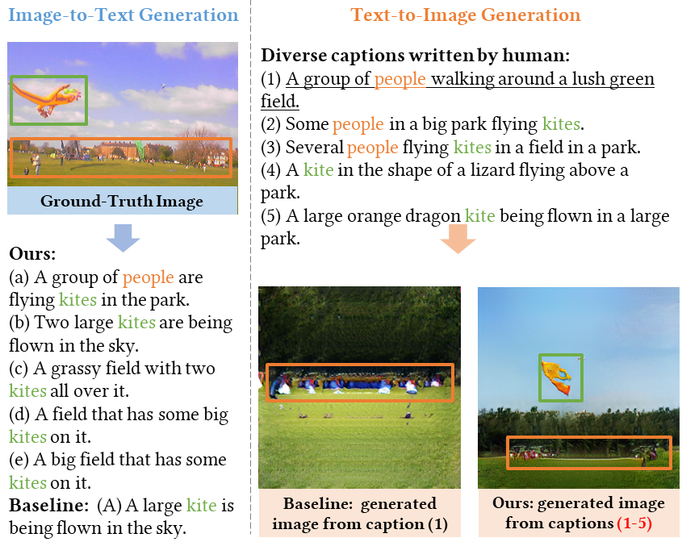
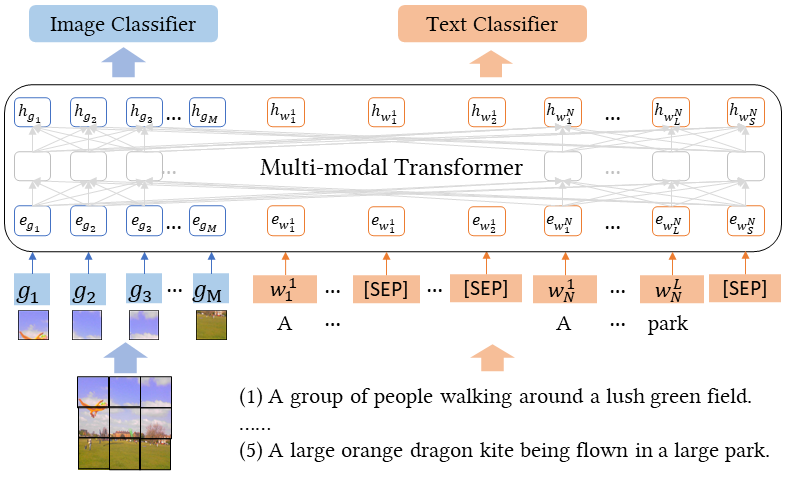

# A Picture is Worth a Thousand Words: A Unified System for Diverse Captions and Rich Images Generation

[A Picture is Worth a Thousand Words: A Unified System for Diverse Captions and Rich Images Generation](https://arxiv.org/abs/2110.09756), \
Yupan Huang, Bei Liu, Jianlong Fu, Yutong Lu, in ACM MM 2021 (Video and Demo Track).

## Introduction
A creative image-and-text generative AI system mimics humans' extraordinary abilities to provide users with diverse and comprehensive caption suggestions, as well as rich image creations. In this work, we demonstrate such an AI creation system to produce both diverse captions and rich images. When users imagine an image and associate it with multiple captions, our system paints a rich image to reflect all captions faithfully. Likewise, when users upload an image, our system depicts it with multiple diverse captions. We propose a unified multi-modal framework to achieve this goal. Specifically, our framework jointly models image-and-text representations with a Transformer network, which supports rich image creation by accepting multiple captions as input. We consider the relations among input captions to encourage diversity in training and adopt a non-autoregressive decoding strategy to enable real-time inference. Based on these, our system supports both diverse captions and rich images generations.


       |  
:-------------------------:|:-------------------------:
Demonstration of our unified system to generate diverse captions from a rich image, and to generate a rich image from diverse captions. |  Overview of our unified multi-modal Transformer.

## Installation

```bash
conda create --name diverse-it-generator python=3.7
conda activate diverse-it-generator

conda install pytorch=1.3.1 torchvision cudatoolkit=10.1 -c pytorch
pip install pandas attrs einops
python -m pip install pandas
pip install yacs h5py tqdm transformers==2.1.1
pip install git+https://github.com/salaniz/pycocoevalcap
```

## Run
* Directly infer a model (e.g., our released models):
    * Using the MSCOCO dataset as in the paper:
    ```bash
    #exp_id=generate_it_sample5_mix_i2t_t2i_unlike1
    exp_id=diverse_it_generator
    inference_params="use_mix_feature 1 use_grid_cluster 1 use_grid_feat 1 autoregressive 0 num_sample_captions 5 \
    samples_per_gpu 40 resume_from_latest 0  load_model_only 1 model_path /path/to/models/ours/diverse_it_generator.pth "
    
    CUDA_VISIBLE_DEVICES="0" python sample_images.py exp_id ${exp_id} ${inference_params}  # text -> image
    CUDA_VISIBLE_DEVICES="0" python inference.py exp_id ${exp_id} ${inference_params}  # image -> text
    ```
    * Text-to-image generation with custom captions (e.g., `assets/captions_5sample.txt`):
    ```bash
    #exp_id=generate_it_sample5_mix_i2t_t2i_unlike1
    exp_id=diverse_it_generator
    inference_params="use_mix_feature 1 use_grid_cluster 1 use_grid_feat 1 autoregressive 0 num_sample_captions 5 \
    samples_per_gpu 40 resume_from_latest 0  load_model_only 1 model_path /path/to/models/ours/diverse_it_generator.pth \
    demo_captions True"
    
    CUDA_VISIBLE_DEVICES="0" python sample_images.py exp_id ${exp_id} ${inference_params}  # text -> image
    ```
    * Image-to-text generation with custom images: you need to extract images features firstly, and then using the similar scripts.

* We train and test our model by the following script:
    ```bash
    gpu_id="0,1,2,3,4,5,6,7"
    NUM_GPUS=8
    #exp_id=generate_it_sample5_mix_i2t_t2i_unlike1
    exp_id=diverse_it_generator
    train_test_params="samples_per_gpu 32 checkpoint_time 10000 scheduler.max_steps 200000 test_interval 10000 \
    scheduler.warmup_steps 10000 solver.lr 5e-5 iteration_tasks ['i2t','t2i'] fp16 1 \
    use_mix_feature 1 use_grid_cluster 1 use_grid_feat 1 autoregressive 0 unlikelihood_training 1 num_sample_captions 5 "
    
    CUDA_VISIBLE_DEVICES=${gpu_id} python -m torch.distributed.launch \
      --nproc_per_node=$NUM_GPUS --master_port=4396 train.py exp_id ${exp_id} ${train_test_params}
    
    CUDA_VISIBLE_DEVICES="0" python sample_images.py exp_id ${exp_id} ${train_test_params}
    ```
    * To train the image-to-text generation baseline model in Table 1, set `unlikelihood_training=0`.
    * To train the text-to-image generation baseline model (FID score 51.5), set `num_sample_captions=1`.

## Results
Image-to-Text Generation:

|   Training Method   | Div-1 ↑ | Div-2 ↑ | Best CIDEr-D ↑ | Average CIDEr-D ↑ |
|------------------------------|-----------|-----------|----------|----------|
| Baseline                     | 23.4%     | 28.3%     | 107.4%   | 100.6%   |
| Unlikelihood Training (Ours) | 40.2%     | 53.2%     | 101.7%   | 80.0%    |

Text-to-Image Generation:

|        Training Method           | FID ↓ |
|----------------------------------|-------|
| Single Caption -> Image          |  51.5 |
| Diverse Captions -> Image (Ours) |  42.1 |
