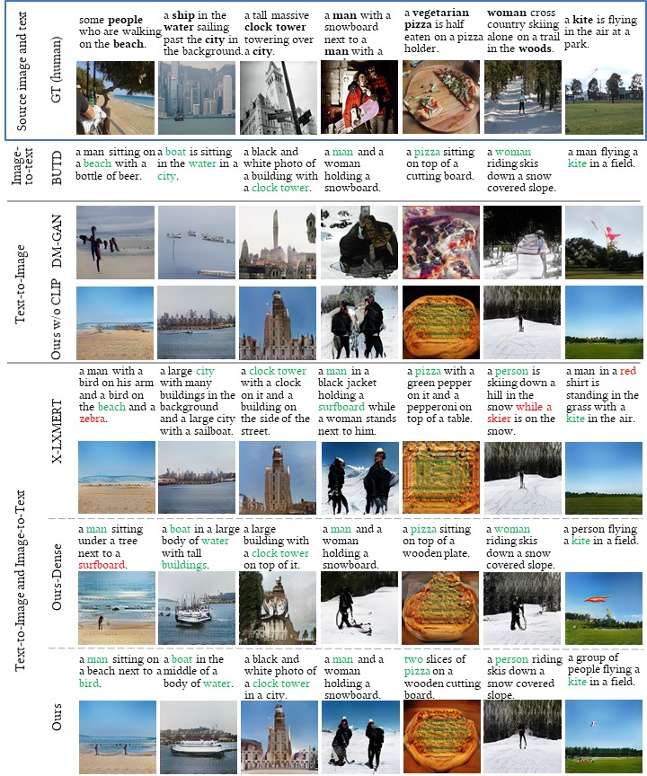

# Unifying Multimodal Transformer for Bi-directional Image and Text Generation

[Unifying Multimodal Transformer for Bi-directional Image and Text Generation](https://arxiv.org/abs/2110.09753), \
Yupan Huang, Bei Liu, Yutong Lu, in ACM MM 2021 (Industrial Track).


## Introduction
We study the joint learning of image-to-text and text-to-image generations, which are naturally bi-directional tasks. Typical existing works design two separate task-specific models for each task, which impose expensive design efforts. In this work, we propose a unified image-and-text generative framework based on a single multimodal model to jointly study the bi-directional tasks. We adopt Transformer as our unified architecture for its strong performance and task-agnostic design. Specifically, we formulate both tasks as sequence generation tasks, where we represent images and text as unified sequences of tokens, and the Transformer learns multimodal interactions to generate sequences. We further propose two-level granularity feature representations and sequence-level training to improve the Transformer-based unified framework. Experiments show that our approach significantly improves previous Transformer-based model X-LXMERT's FID from 37.0 to 29.9 (lower is better) for text-to-image generation, and improves CIDEr-D score from 100.9% to 123.5% for fine-tuned image-to-text generation on the MS-COCO dataset. Our code is available online.


## Installation

```bash
conda create --name it-generator python=3.7
conda activate it-generator
cd  generations
pip install -r ./requirements.txt
```


## Run

Directly infer a model (e.g., our released models) with the following script:
```bash
exp_id=it_generator
inference_params="use_mix_feature 1 use_grid_cluster 1 use_grid_feat 1 test_num 50 text_length 17 test_val2014 1 \
samples_per_gpu 10 resume_from_latest 0  load_model_only 1 model_path /path/to/models/ours/it_generator.pth "

CUDA_VISIBLE_DEVICES="0" python sample_images.py exp_id ${exp_id} ${inference_params}  # text -> image
CUDA_VISIBLE_DEVICES="0" python inference.py exp_id ${exp_id} ${inference_params}  # image -> text
```

We train and test our model with the following scripts:
* Stage 1. Token-level Training. 
  
  This stage aims to generate fluent captions and realistic images by "teacher-forcing" training on **word level** or **grid level** in each step for image-to-text or text-to-image generation respectively.

  ```bash
  gpu_id="0,1,2,3,4,5,6,7"
  NUM_GPUS=8
  #exp_id=generate_it_xe_i2t_xe_t2i_train2014_mixfeature
  exp_id=it_generator_stage1
  train_test_params=" \
  samples_per_gpu 32 test_interval 10000 checkpoint_time 10000 scheduler.max_steps 200000 \
  train_split train use_mix_feature 1 use_grid_cluster 1 use_grid_feat 1 \
  scheduler.method WarmupCosineSchedule solver.lr 5e-5 scheduler.warmup_steps 10000 \
  load_model_only 0 resume_from_latest 1 iteration_tasks ['xe_i2t','xe_t2i']  "
  
  
  CUDA_VISIBLE_DEVICES=${gpu_id} python -m torch.distributed.launch \
    --nproc_per_node=$NUM_GPUS --master_port=4396 train.py exp_id ${exp_id} ${train_test_params}
  
  
  train_test_params=" test_num -1 samples_per_gpu 10 load_model_only 1 resume_from_latest 1 \
  eval_fid 0 eval_is 0 eval_clipscore 0 test_val2014 1 "
  CUDA_VISIBLE_DEVICES="0" python sample_images.py exp_id ${exp_id} ${train_test_params}
  
  
  train_test_params=" eval_fid 0 eval_is 0 eval_clipscore 1 eval_rprec 0 eval_rprec_hard 0 test_val2014 1 test_num -1 "
  CUDA_VISIBLE_DEVICES="0" python evaluate_images.py exp_id ${exp_id} ${train_test_params} &
  
  train_test_params=" eval_fid 1 eval_is 0 eval_clipscore 0 eval_rprec 0 eval_rprec_hard 0 test_val2014 1 test_num -1 "
  CUDA_VISIBLE_DEVICES="1" python evaluate_images.py exp_id ${exp_id} ${train_test_params} &
  
  train_test_params=" eval_fid 0 eval_is 0 eval_clipscore 0 eval_rprec 1 eval_rprec_hard 1 test_val2014 1 test_num -1 "
  CUDA_VISIBLE_DEVICES="2" python evaluate_images.py exp_id ${exp_id} ${train_test_params} &
  
  wait
  ```

* Stage 2. Sequence-level Training.
  
    This stage further optimizes the model with generated **text** or **image** sequence to bridge the gap between training and testing.
  ```bash
  gpu_id="0,1,2,3,4,5,6,7"
  NUM_GPUS=8
  #exp_id=generate_it_rl_i2t_rl_t2i_xe_t2i_lr1e6_bsz20_train2014_mixfeature_mse0_clip1_50wstep_len16
  exp_id=it_generator
  train_test_params=" \
  samples_per_gpu 20 test_interval 10000 checkpoint_time 10000 scheduler.max_steps 500000 \
  train_split train use_mix_feature 1 use_grid_cluster 1 use_grid_feat 1  \
  scheduler.method ConstantLRSchedule solver.lr 1e-6 num_workers 2 \
  load_model_only 1 resume_from_latest 1 model_path ../../models/generate-it/output/it_generator_stage1/model_0200000.pth \
  iteration_tasks ['rl_i2t','rl_t2i','xe_t2i'] mse_loss 0 use_clip_score 1 text_length 16 "
  
  CUDA_VISIBLE_DEVICES=${gpu_id} python -m torch.distributed.launch \
    --nproc_per_node=$NUM_GPUS --master_port=4396 train.py exp_id ${exp_id} ${train_test_params}
  
  
  train_test_params=" test_num -1 samples_per_gpu 10 load_model_only 1 resume_from_latest 1 \
  eval_fid 0 eval_is 0 eval_clipscore 0 test_val2014 1 "
  CUDA_VISIBLE_DEVICES="0" python sample_images.py exp_id ${exp_id} ${train_test_params}
  
  
  train_test_params=" eval_fid 0 eval_is 0 eval_clipscore 1 eval_rprec 0 eval_rprec_hard 0 test_val2014 1 test_num -1 "
  CUDA_VISIBLE_DEVICES="0" python evaluate_images.py exp_id ${exp_id} ${train_test_params} &
  
  train_test_params=" eval_fid 1 eval_is 0 eval_clipscore 0 eval_rprec 0 eval_rprec_hard 0 test_val2014 1 test_num -1 "
  CUDA_VISIBLE_DEVICES="1" python evaluate_images.py exp_id ${exp_id} ${train_test_params} &
  
  train_test_params=" eval_fid 0 eval_is 0 eval_clipscore 0 eval_rprec 1 eval_rprec_hard 1 test_val2014 1 test_num -1 "
  CUDA_VISIBLE_DEVICES="2" python evaluate_images.py exp_id ${exp_id} ${train_test_params} &
  
  wait
  ```


The parameter settings of other ablation models in our Table 1 in paper:
* w/o unified architecture:
    * Stage 1: set `iteration_tasks ['xe_i2t']` for I->T, and `iteration_tasks ['xe_t2i']` for T->I. Also set `scheduler.max_steps 100000 scheduler.warmup_steps 5000`.
    * Stage 2: set `iteration_tasks ['rl_i2t']` for I->T, and `iteration_tasks ['rl_t2i','xe_t2i']` for T->I. Also set `scheduler.max_steps 200000` for I->T and `scheduler.max_steps 300000` for T->I.
* w/o two-level features:
    * Dense feature: `use_mix_feature 0 use_grid_cluster 0 use_grid_feat 1`
    * Discrete feature: `use_mix_feature 0 use_grid_cluster 1 use_grid_feat 0`
* w/o sequence-level training: do not train stage 2.
* w/o CLIP-based loss: set `mse_loss 1 use_clip_score 0` in stage 2.


## Examples


